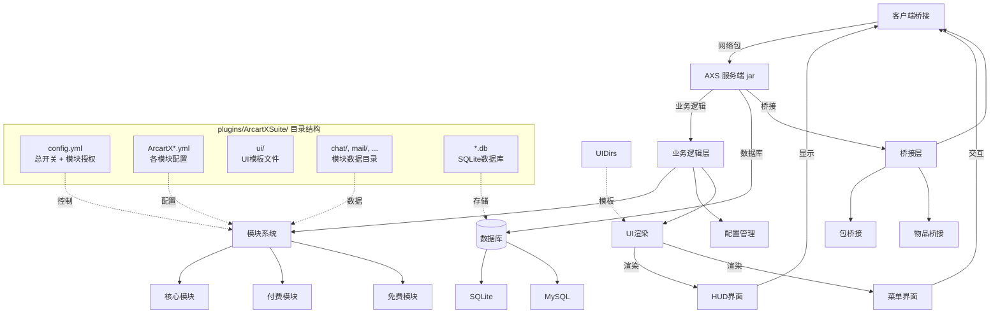
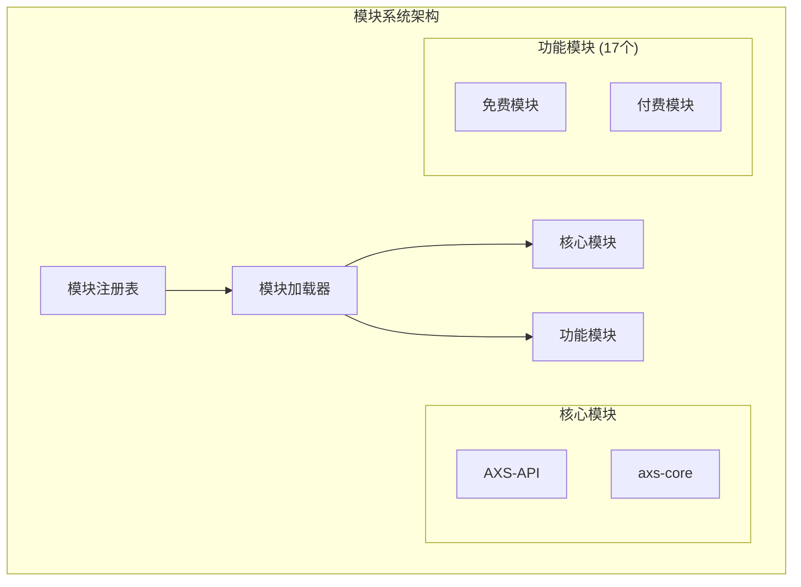
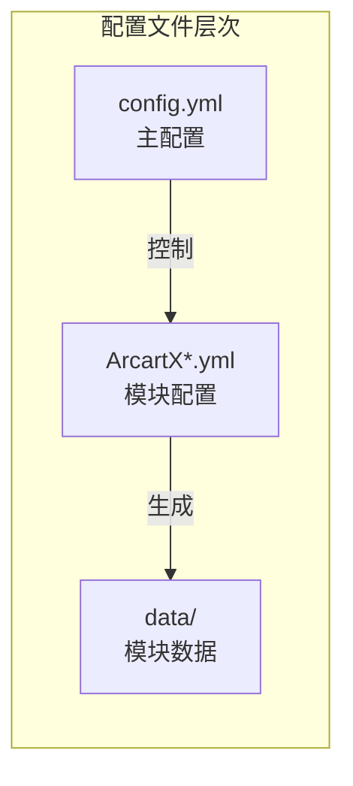

# ArcartXSuite 系统架构

## 整体架构图

## 组件说明

### 1. 客户端侧
- **ArcartX 客户端 MOD**: 玩家安装的客户端模组，负责UI渲染和HUD显示

### 2. 服务端核心
- **AXS 服务端 jar**: 服务端插件主程序，包含核心业务逻辑
- **业务逻辑层**: 处理模块管理、配置解析、UI渲染等核心功能
- **模块系统**: 管理17个功能模块的加载、卸载和交互
- **配置管理**: 统一管理所有配置文件和热重载
- **UI渲染**: 生成ArcartX UI界面并发送给客户端

### 3. 文件系统结构
`plugins/ArcartXSuite/` 目录包含：
- **config.yml**: 总开关配置和模块授权设置
- **ArcartX*.yml**: 各模块的主配置文件
- **ui/**: ArcartX UI模板文件
- **chat/, mail/, ...**: 各模块的数据目录
- ***.db**: SQLite数据库文件

### 4. 数据存储
- **SQLite**: 默认的单机数据库
- **MySQL**: 可选的多服共享数据库

### 5. 桥接层
- **包桥接**: 与ArcartX客户端的网络通信
- **客户端桥接**: 客户端功能调用
- **物品桥接**: 物品数据处理

## 数据流向

1. **客户端 → 服务端**: 玩家操作通过网络包发送到服务端
2. **服务端处理**: 业务逻辑层处理请求，读取配置，调用模块功能
3. **数据存储**: 将数据保存到SQLite或MySQL数据库
4. **UI生成**: 根据配置和数据生成UI界面
5. **服务端 → 客户端**: 将UI数据通过网络包发送给客户端
6. **客户端渲染**: 客户端MOD接收数据并渲染界面

## 模块架构

## 配置文件层次

这个架构图清晰地展示了：
1. 客户端与服务端的分离
2. 文件系统结构作为服务端的子部分
3. 明确的数据流向和组件关系
4. 模块系统的层次结构
5. 配置文件的管理层次
